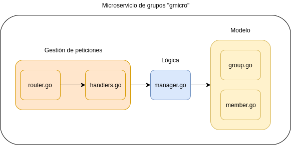

# PayUp

[](https://travis-ci.com/Varrrro/pay-up)
[](https://codecov.io/gh/Varrrro/pay-up)
[](https://www.gnu.org/licenses/gpl-3.0)

> **Nota:** Puede encontrar toda la documentación en la [página web del proyecto](https://varrrro.github.io/pay-up/).

## Arquitectura de la aplicación

La aplicación usa una arquitectura de microservicios, con dos que gestionan las dos partes principales del dominio del problema:

* `gmicro`: Gestión de grupos y sus miembros. Tareas CRUD básicas sobre estos conjuntos.
* `tmicro`: Gestión de las transacciones. Añadir pagos y gastos realizados en un grupo.

El microservicio que se ha implementado hasta ahora es `gmicro`, del cuál vamos a hablar más en profuncidad a continuación:

### Arquitectura del microservicio

Se usa una arquitectura por capas, separando el modelo, la lógica de negocio y la gestión de las peticiones que recibe el microservicio. La implementación de esta arquitectura se puede ver en el siguiente diagrama:



Vamos a repasar los componentes principales:

* `router.go`: Define las rutas del microservicio que aceptan peticiones, así como el verbo HTTP necesario y la función _handler_ encargada de darle respuesta.
* `handlers.go`: Define las funciones _handler_ que gestionan las peticiones a las distintas rutas. Todas ellas se encargan de decodificar la petición, llamar a la lógica de negocio y codificar la respuesta.
* `manager.go`: Contiene la lógica de negocio y actúa como _single source of truth_ sobre el modelo de datos. Es el que realiza todas las operaciones sobre la conexión de base de datos que le es dada.
* `group.go` y `member.go`: Constituyen el modelo de datos del microservicio. Usamos el ORM para crear las tablas de la base de datos a partir de los _struct_ definidos aquí.

### Rutas de `gmicro`

El microservicio `gmicro` presenta las siguientes rutas o _endpoints_ sobre los que se pueden realizar peticiones:

* `GET /`: Devuelve un indicador del estado del microservicio. Útil para comprobar si está funcionando.
* `POST /groups`: Crea un nuevo grupo. Debe enviar un nombre para el grupo como JSON en el cuerpo de la petición.
* `GET /groups/{groupid}`: Devuelve un grupo concreto, identificado por el ID dado en la ruta de la petición.
* `POST /groups/{groupid}`: Añade un nuevo miembro a un grupo concreto, identificado por el ID dado en la ruta de la petición. Debe enviar un nombre para el miembro como JSON en el cuerpo de la petición.
* `PUT /groups/{groupid}`: Cambia el nombre de un grupo concreto, identificado por el ID dado en la ruta de la petición. Debe enviar un nuevo nombre para el grupo como JSON en el cuerpo de la petición.
* `DELETE /groups/{groupid}`: Elimina un grupo, identificado por el ID dado en la ruta de la petición.
* `GET /groups/{groupid}/members/{memberid}`: Devuelve un miembro de un grupo concreto, identificado por los IDs dados en la ruta de la petición.
* `PUT /groups/{groupid}/members/{memberid}`: Cambia el nombre de un miembro concreto, identificado por los IDs dados en la ruta de la petición. Debe enviar un nuevo nombre para el miembro como JSON en el cuerpo de la petición.
* `DELETE /groups/{groupid}/members/{memberid}`: Elimina un miembro de un grupo, identificado por los IDs dados en la ruta de la petición. El miembro no puede tener un balance distinto de cero para ser eliminado.

## Herramienta de construcción

Para gestionar las distintas tareas relativas al proyecto, usaremos [Tusk](https://github.com/rliebz/tusk) como herramienta de construcción. Las tareas que se han definido se encuentran en el siguiente archivo:

> buildtool: tusk.yml

## Definición de la imagen Docker

Una vez terminada la implementación del microservicio de grupos (al cuál he llamado `gmicro`), definimos una imagen Docker para poder desplegarlo como un contenedor en cualquier plataforma de manera sencilla. La imagen se puede encontrar en el siguiente enlace:

> Contenedor: https://hub.docker.com/r/varrrro/pay-up
> 
> __NOTA:__ La construcción automática en _Docker Hub_ se realiza enlazando el repositorio de esa web con el de GitHub.

A continuación, vamos a explicar las distintas partes del `Dockerfile` del contenedor.

```dockerfile
FROM golang:1.13-alpine3.10

LABEL maintainer="Víctor Vázquez <victorvazrod@correo.ugr.es>"

WORKDIR /app
```

Usaremos como imagen base la oficial de Go 1.13 hecha con Alpine. En la sección de comparación de imágenes se explica por qué se ha elegido esta en concreto. Definimos quien es el encargado de mantener la imagen y el directorio de trabajo dentro del contenedor, el cuál será `/app`.

```dockerfile
RUN apk update \
    && apk add --no-cache supervisor \
    && apk add --no-cache --virtual .build-deps \
        git \
        curl \
        bash \
    && curl -sL https://git.io/tusk | bash -s -- -b /usr/local/bin latest \
    && apk del .build-deps
```

Existen algunos paquetes que necesitamos instalar en el contenedor para la construcción del mismo. Primero, actualizamos los repositorios de paquetes con `apk update` e instalamos `supervisor`, herramienta que usamos para lanzar y gestionar el proceso del microservicio.

Luego, instalamos `git`, `curl` y `bash` haciendo uso de la opción `--virtual .build-deps`. Con este argumento, lo que hacemos es agrupar estos paquetes instalados dentro de un paquete virtual de nombre `.build-deps` que facilita su gestión. El argumento `--no-cache` hace que no se almacene el índice de paquetes localmente, lo que nos permite reducir el tamaño de la imagen.

Los paquetes de `.build-deps` los necesitamos solo para instalar `tusk`, la herramienta de construcción del proyecto, por lo que los eliminamos después de hacerlo haciendo uso del paquete virtual.

```dockerfile
COPY tusk.yml go.mod go.sum ./

RUN tusk install
```

Copiamos tanto el archivo que define las distintas _tasks_ de `tusk` como los ficheros que especifican las dependencias del proyecto, las cuales se instalan con `tusk install`.

```dockerfile
COPY cmd/gmicro/gmicro.go .
COPY internal/gmicro/*.go internal/gmicro/
COPY internal/gmicro/group/*.go internal/gmicro/group/
COPY internal/gmicro/member/*.go internal/gmicro/member/

ENV CGO_ENABLED=0

RUN tusk build

RUN rm -f gmicro.go && rm -rf internal/
```

Copiamos todos los fuentes del microservicio y compilamos con `tusk build`. Hay que destacar que hay que deshabilitar el uso de CGO para la compilación. CGO es una herramienta que permite la llamada a código C desde un paquete escrito en Go.

Esto ocurre con el paquete `net`, el cuál usamos para crear el servidor HTTP de nuestro servicio. Deshabilitamos entonces el CGO para evitar que el compilador genere un binario dinámico, el cuál provoca errores dentro del contenedor.

Después de compilar el código, eliminamos todos los fuentes para reducir el tamaño de la imagen.

```dockerfile
COPY init/gmicro.conf /etc/supervisor/conf.d/

EXPOSE ${PORT}

CMD [ "tusk", "run" ]
```

Por último, copiamos el fichero de configuración del proceso que usará `supervisord` para lanzarlo y controlarlo, exponemos el puerto del contenedor que va a recibir las peticiones y, con `CMD`, definimos el comando que se ejecuta dentro del contenedor cuando éste se lance (con `docker run`, por ejemplo). En nuestro caso, `tusk run` iniciará el microservicio a través de `supervisord`.

## Definición del proceso

Como ya hemos indicado en la sección anterior, utilizamos `supervisord` para controlar el proceso. Esto nos permite automatizar su ejecución y relanzarlo si ocurre algún error. También genera ficheros de _log_ sobre la ejecución del mismo. El fichero `gmicro.conf` define la configuración de este proceso, que se puede ver a continuación:

```apacheconf
[supervisord]
nodaemon=true

[program:gmicro]
directory=/usr/local
command=/usr/local/bin/gmicro

autostart=true
autorestart=true
```

Vamos a repasar por encima esta configuración. `nodaemon` hace que el proceso se ejecute en primer plano, `directory` indica el directorio de trabajo, `command` la ruta del ejecutable del proceso, `autostart` hace que el proceso se lance automáticamente al añadirlo al supervisor y `autorestart` hace que el supervisor lo relance si éste para su ejecución por cualquier causa.

Para ejecutar el proceso, colocamos este fichero en `/etc/supervisor/conf.d/` y se lo pasamos a `supervisord` con el argumento `-c`.

## Comparación de imágenes base

A parte de la imagen Alpine que se ha decidido usar como base, Go ofrece otras imágenes oficiales basadas en Debian Buster y Stretch. A continuación, vamos a comparar estas imágenes para ver por qué se ha elegido Alpine.

Construyendo las imágenes y usando `docker image ls` vemos los tamaños de cada una.

```
REPOSITORY          TAG                 IMAGE ID            CREATED             SIZE
gmicro-buster       latest              0186d16baa32        21 seconds ago      1.25GB
gmicro-stretch      latest              f79f68504c7b        2 minutes ago       1.2GB
gmicro-alpine       latest              b612a5a195e6        6 minutes ago       787MB
```

Como se puede ver, la imagen basada en Alpine es considerablemente más pequeña que las otras dos, con 787MB de tamaño.

Para comparar el rendimiento de las imágenes, usamos la herramienta Apache Benchmark para realizar unas pruebas sencillas de carga. Con el comando `ab -n 10000 -c 100 http://localhost:8080/` realizamos 10000 peticiones al microservicio que se ejecuta en el contenedor, con un máximo de 100 concurrentes. Los resultados que obtenemos son los siguientes:

```
REPOSITORY        REQUESTS PER SECOND     TIME PER REQUEST    TOTAL TIME
gmicro-buster     13862.57                7.214 ms            0.721 s
gmicro-stretch    13213.79                7.568 ms            0.757 s
gmicro-alpine     14071.55                7.107 ms            0.711 s
```

Alpine también gana en rendimiento a las otras dos opciones. Es por ello que la elegimos como imagen base para la imagen de nuestro microservicio.

## Despliegue a Heroku

Para comprobar el correcto funcionamiento del contenedor, se ha desplegado a Heroku siguiendo los pasos de [su guía](https://devcenter.heroku.com/articles/build-docker-images-heroku-yml). El fichero `heroku.yml` que define el despliegue es el siguiente:

```yaml
build:
    docker:
        web: Dockerfile
```

Aquí, se indica a Heroku que lo que se debe construir es una imagen Docker. En `web`, se indica la ruta al `Dockerfile` relativa a la raíz del proyecto.

Podemos encontrar el contenedor funcionando en la dirección https://payup-gmicro.herokuapp.com/. Al hacer una petición GET a esta ruta, obtendremos un JSON como el siguiente:

```json
{"status":"OK"}
```